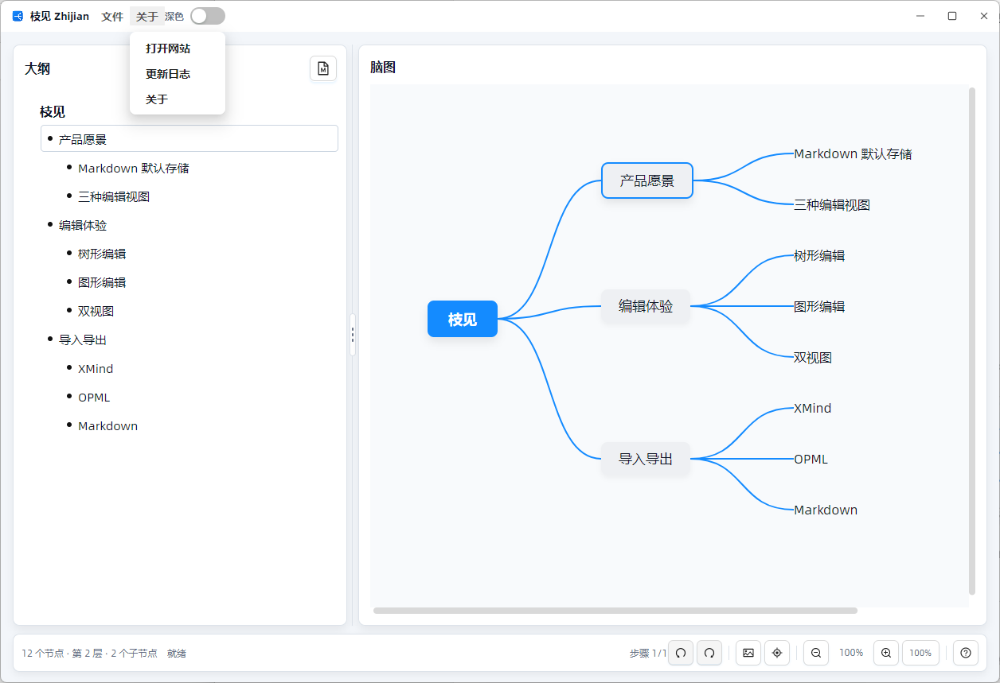
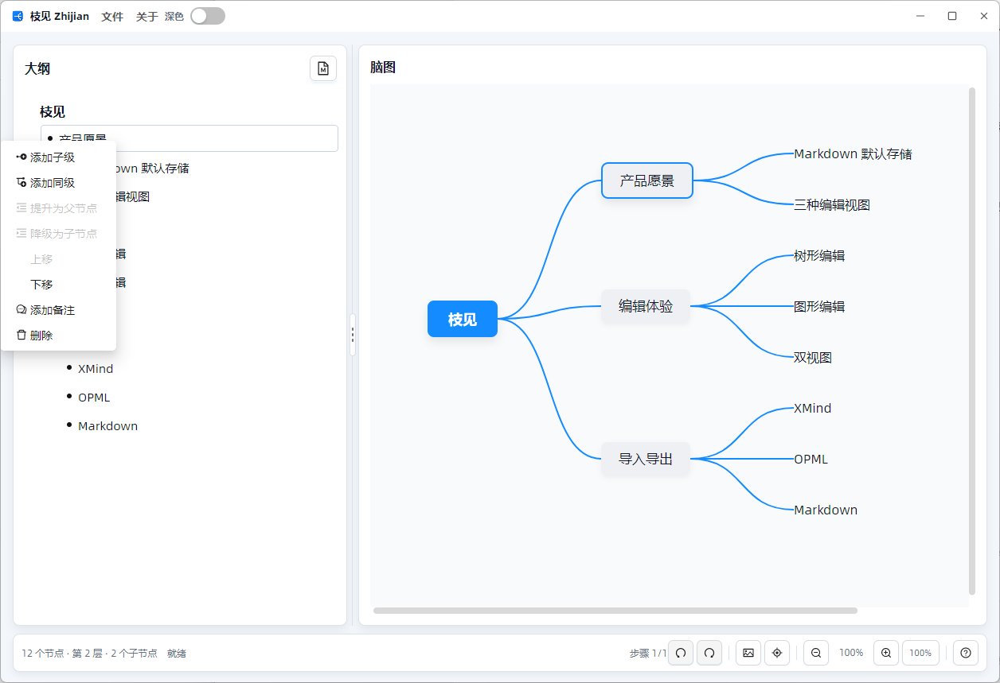
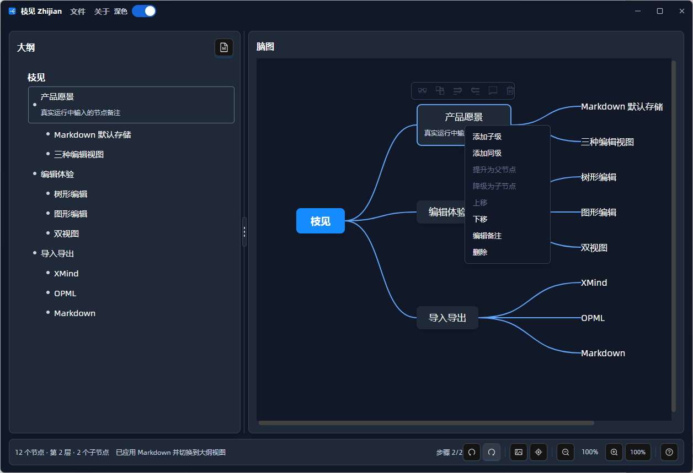
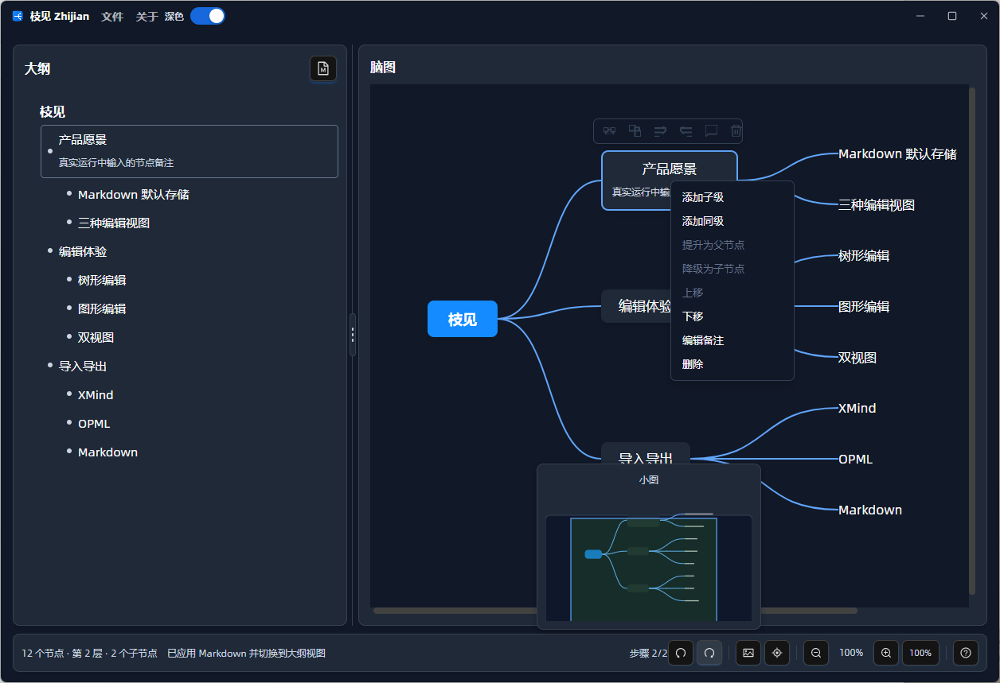

# Zhijian

Zhijian is a local, Markdown-first mind-map editor built with C#, Avalonia, and AtomUI. It keeps the outline, Markdown text, and graphical mind map synchronized over the same document model, so users can write structure quickly and still inspect the result visually.

Chinese documentation: [README.zh-CN.md](README.zh-CN.md)

Repository: <https://github.com/dotnet9/Zhijian>


## Highlights

- Dual-pane workflow with outline or Markdown editing on the left and a live mind-map canvas on the right.
- Markdown-first document model: headings become topics, and body text under a heading becomes that node's note.
- Inline title and note editing in both outline and mind-map views.
- Resizable outline and mind-map panes with a visible splitter.
- User-friendly outline and mind-map menus for adding siblings or children, promoting or demoting nodes, moving nodes, editing notes, and deleting nodes.
- Mind-map panning, zooming, center-topic navigation, and a real mini-map based on current node coordinates.
- Markdown, OPML, and XMind import/export.
- AtomUI shell, title-bar menus, dialogs, tooltips, and dark theme.
- Reusable `CodeWF.MindView` controls that depend only on Avalonia, not AtomUI.

## Runtime Preview

The following screenshots and GIFs were captured from a real running Zhijian desktop session with simulated user operations.











## Editing Workflow

The left pane is the main writing area. Use outline mode when you want structured editing, or switch to Markdown when text-first editing is faster. The right pane updates immediately from the same `MindMapNode` tree.

Useful keyboard behavior while editing a node title:

- `Enter`: add a sibling node. If the selected outline node has children, Zhijian adds a child node.
- `Tab`: add or demote to a child node.
- `Shift + Tab`: promote a node.
- `Delete` or `Backspace`: delete an empty non-root node.
- `Ctrl + mouse wheel`: zoom the mind-map canvas.
- `Ctrl + L`: return to the center topic.

## File Formats

Zhijian uses Markdown as the default readable format and can exchange data with common mind-map tools:

- Markdown (`.md`, `.markdown`)
- OPML (`.opml`, `.xml`)
- XMind (`.xmind`)

## Project Structure

```text
Zhijian/
|-- src/CodeWF.MindView/        reusable mind-map controls and document codecs
|-- src/CodeWF.MindView.Themes/ default resources for CodeWF.MindView
|-- src/Zhijian/                Avalonia and AtomUI desktop application
|-- docs/                       architecture and source-design documentation
|-- docs/media/                 runtime screenshots and GIFs
|-- CHANGELOG.md                English changelog
|-- CHANGELOG.zh-CN.md          Chinese changelog
`-- Zhijian.slnx                solution file
```

## Reusing CodeWF.MindView

`src/CodeWF.MindView` is independent from AtomUI. A new Avalonia app can reference `CodeWF.MindView` and `CodeWF.MindView.Themes`, register `<mindThemes:MindViewThemes />` in `App.axaml`, and place `MindMapEditor` in a view:

```xml
<mind:MindMapEditor
    Roots="{Binding Roots}"
    SelectedNode="{Binding SelectedNode, Mode=TwoWay}"
    Controller="{Binding}" />
```

The host ViewModel provides an `ObservableCollection<MindMapNode>` and implements `IMindMapEditorController` for level lookup, node creation, deletion, promotion, and drag/drop moves. The `src/Zhijian` app is the complete AtomUI desktop reference around the reusable control.

See [docs/source-design.md](docs/source-design.md) for the reusable-control integration details.

## Open Source Thanks

Zhijian is built on excellent open source platforms and libraries:

- [Dotnet](https://dotnet.microsoft.com/zh-cn/)
- [Avalonia UI](https://avaloniaui.net/)
- [Semi.Avalonia](https://github.com/irihitech/Semi.Avalonia)
- [Ursa.Avalonia](https://github.com/irihitech/Ursa.Avalonia)
- [AtomUI](https://github.com/AtomUI/AtomUI)

## Development

Requirements:

- .NET 10 SDK

Common commands:

```powershell
dotnet restore Zhijian.slnx
dotnet build Zhijian.slnx
dotnet run --project src/Zhijian/Zhijian.csproj
```

## Documentation

- [Architecture](docs/architecture.md)
- [Architecture Chinese](docs/architecture.zh-CN.md)
- [Source Design](docs/source-design.md)
- [Source Design Chinese](docs/source-design.zh-CN.md)
