# 枝见 Zhijian

枝见是一个基于 C# 和 Avalonia 的本地 Markdown-first 脑图编辑器。它把大纲、Markdown 文本和图形脑图绑定到同一份文档模型上，适合写文章提纲、梳理功能设计和整理项目结构。

English documentation: [README.md](README.md)

仓库地址：<https://github.com/dotnet9/Zhijian>

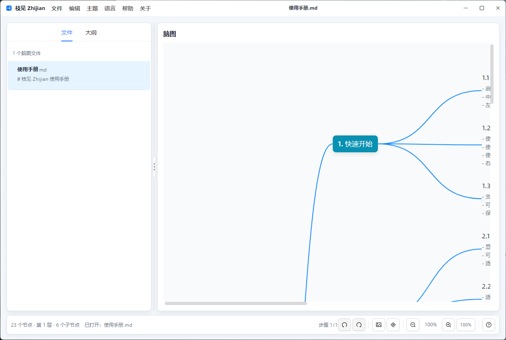

## 功能亮点

- 启动后默认加载随程序输出的 `使用手册.md`，首屏就是一份真实的多层级脑图。
- 文件菜单支持新建、新建窗口、打开、打开文件夹、最近文件、保存、另存为、打开文件位置和关闭。
- 编辑菜单支持撤销、重做、添加同级、添加子级、提升、降级、上移、下移、删除节点和复制为 Markdown。
- 主题、语言、帮助和关于菜单集中在标题栏，常用项带有图标和快捷键。
- 语言切换使用 `Lang.Avalonia.Json` 资源，覆盖中文简体、中文繁体、英语和日语。
- 首次启动新手引导会精准高亮标题栏文件菜单、大纲编辑区、Markdown 切换、脑图画布和底部导航，并提供“跳过”按钮。
- `src/Zhijian/App.config` 集中管理新手引导、默认语言、最近文件数、历史步数和运行状态文件名。
- 左侧提供“文件 / 大纲”两个 Tab：单独打开的文件会出现在文件列表中；打开文件夹时会列出该目录下所有支持的脑图文件。
- 大纲、Markdown 和脑图视图共享同一棵 `MindMapNode` 树。
- 大纲和脑图都支持标题、备注内联编辑。
- 大纲和脑图菜单提供添加同级、添加子级、提升、降级、上移、下移、备注和删除等高频操作。
- 脑图支持画布拖拽、缩放、回到中心主题，以及基于真实节点坐标的小图导航。
- 复制为 Markdown 会把当前文档 Markdown 写入剪贴板，并显示桌面全局消息。
- 支持 Markdown、OPML、XMind 打开和保存。
- 应用外壳提供标题栏菜单、对话框、列表控件、ToolTip、全局消息和深色主题。
- 可复用的 `CodeWF.MindView` 控件只依赖 Avalonia，并与桌面应用外壳解耦。

## 运行预览

下面的截图和 GIF 已按当前界面重新制作，并使用默认加载的使用手册，便于观察文件列表、小图、缩放和画布拖拽效果。

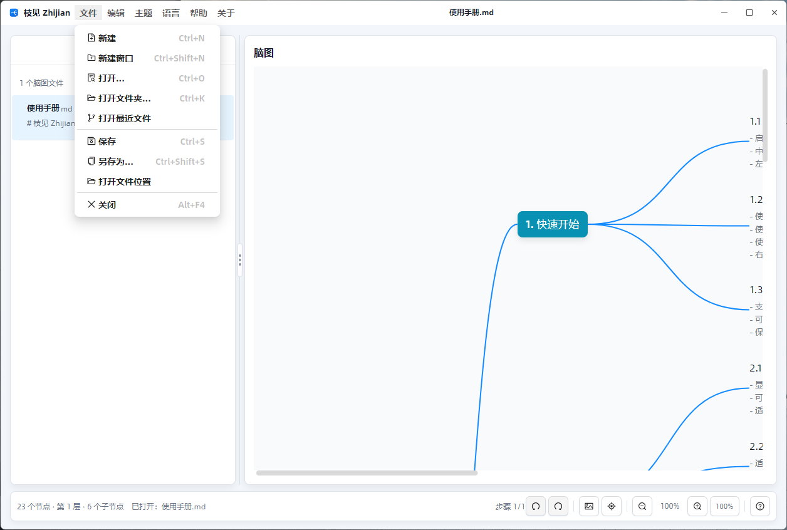

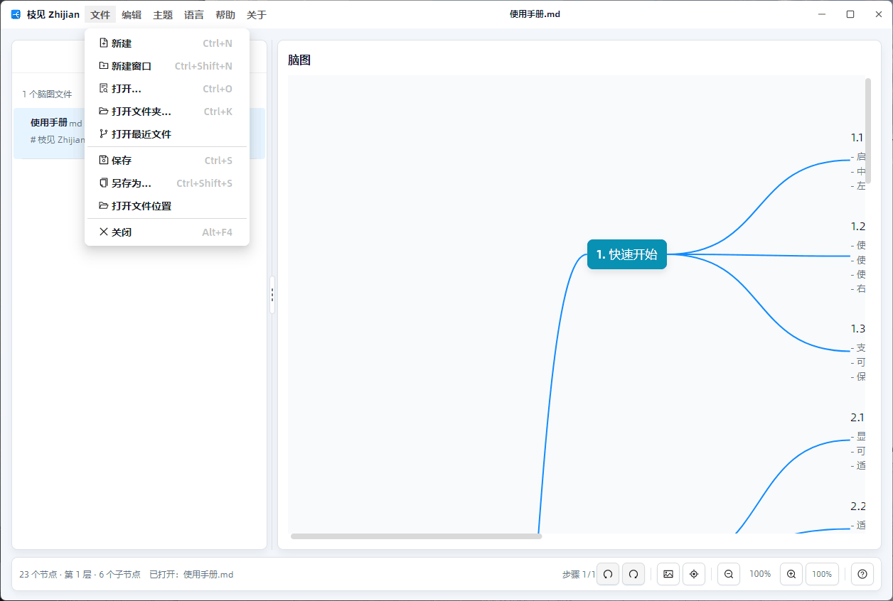

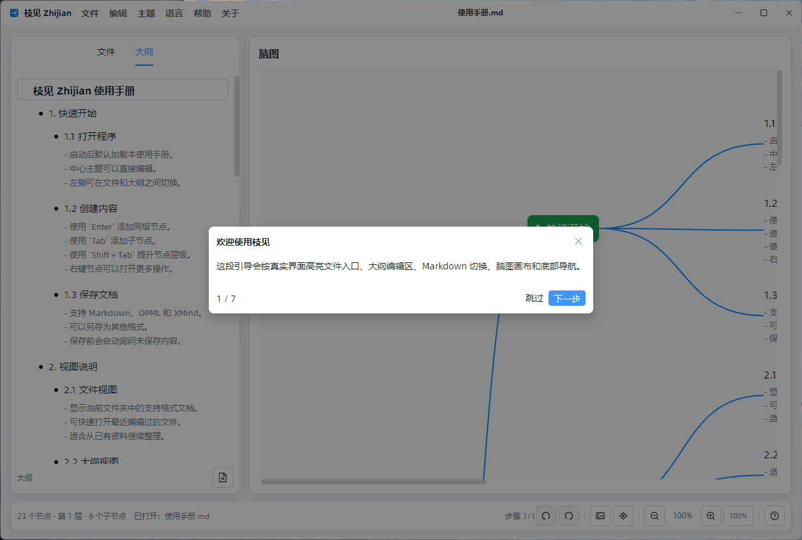

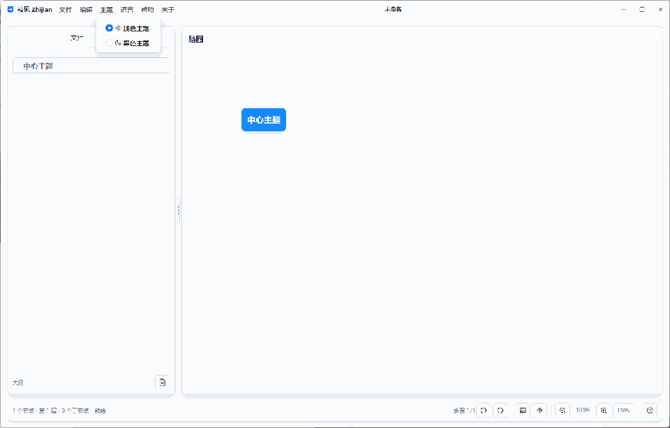

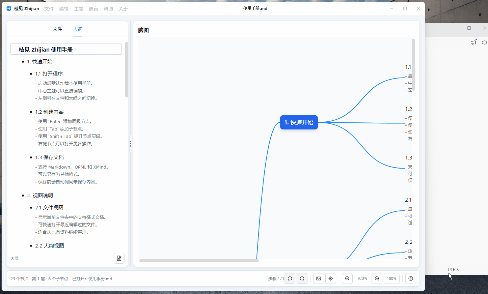

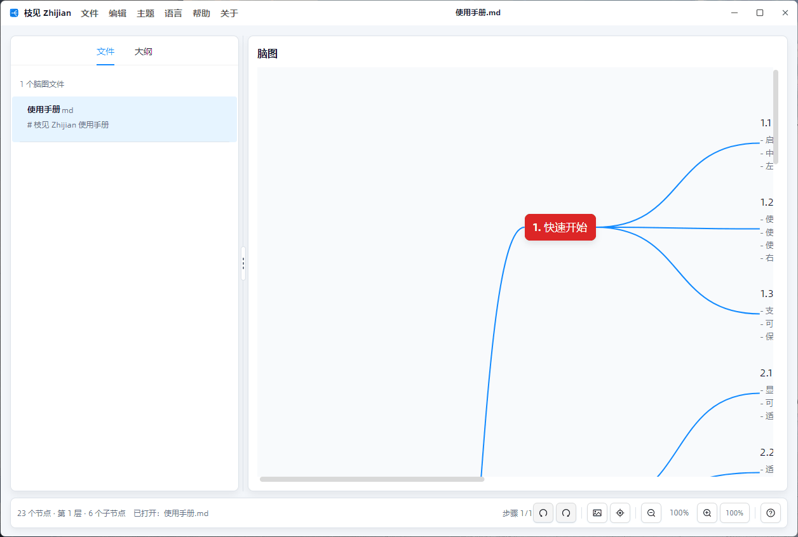

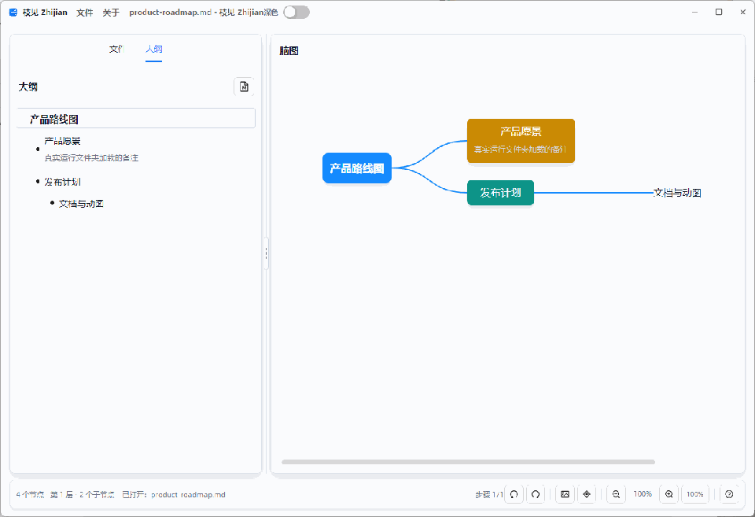

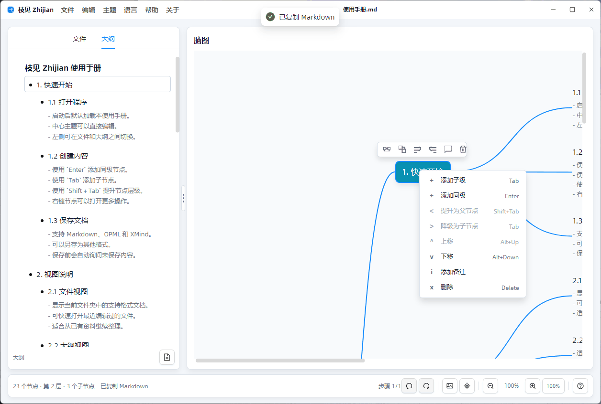

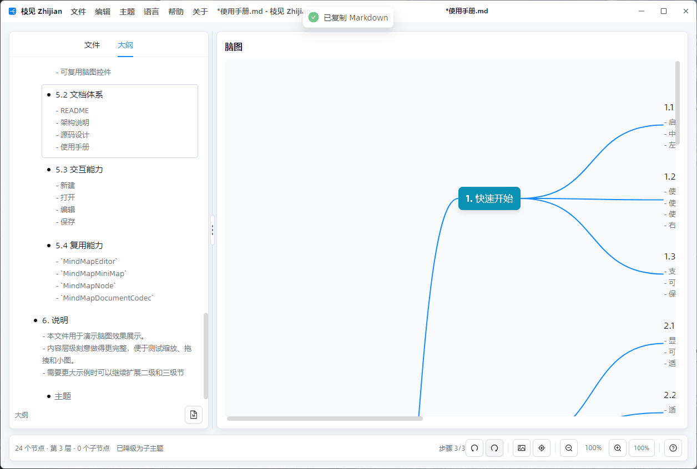

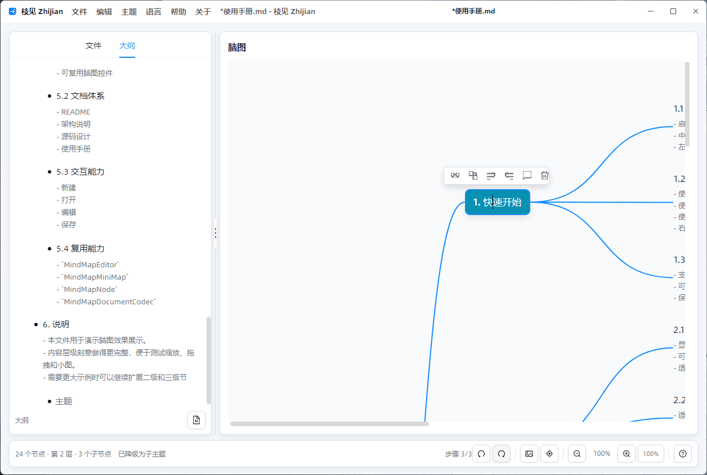


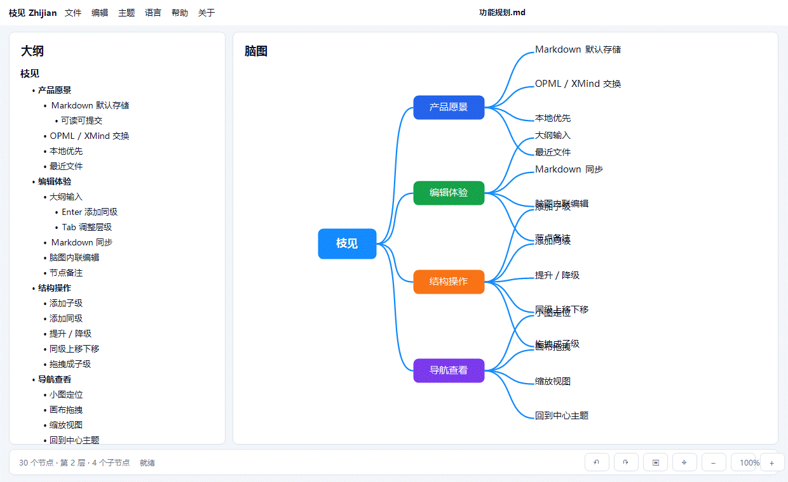


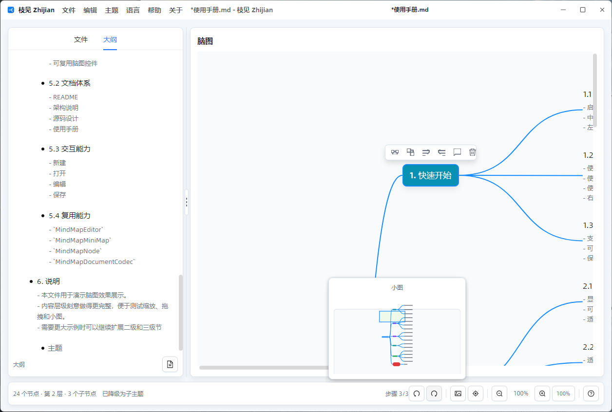


## 编辑流程

左侧是主要输入区。使用大纲模式快速组织层级；需要纯文本维护时切换到 Markdown；右侧脑图会从同一份数据实时刷新。

节点标题编辑时常用快捷键：

- `Enter`：添加同级节点。若当前大纲节点已有子节点，则添加子节点。
- `Tab`：添加子节点或降级为子节点。
- `Shift + Tab`：提升节点。
- `Delete` 或 `Backspace`：删除空的非根节点。
- `⌘ + 鼠标滚轮`（macOS）或 `Ctrl + 鼠标滚轮`（Windows/Linux）：缩放脑图。
- `Space + 左键拖拽`：拖拽脑图画布。
- `⌘ + L`（macOS）或 `Ctrl + L`（Windows/Linux）：回到中心主题。

## 文件格式

枝见默认使用可读 Markdown 保存，也可以与常见脑图工具交换数据：

- Markdown (`.md`, `.markdown`)
- OPML (`.opml`, `.xml`)
- XMind (`.xmind`)

## 复用 CodeWF.MindView

`src/CodeWF.MindView` 独立于应用外壳。新的 Avalonia 应用可以引用 `CodeWF.MindView` 和 `CodeWF.MindView.Themes`，在 `App.axaml` 注册 `<mindThemes:MindViewThemes />`，然后在页面中使用 `MindMapEditor`。普通接入只需要绑定节点集合和当前选择：

```xml
<mind:MindMapEditor
    Roots="{Binding Roots}"
    SelectedNode="{Binding SelectedNode, Mode=TwoWay}" />
```

`MindMapEditor` 内置添加子级、添加同级、升降级、同级上下移动、删除、拖拽移动和自动布局。需要接入撤销历史、保存状态或业务规则时，再把 `Controller="{Binding}"` 指向实现 `IMindMapEditorController` 的宿主 ViewModel。`src/Zhijian` 是围绕可复用控件构建文件工作流、大纲编辑、Markdown 同步和桌面外壳的完整参考。

更完整的接入说明见 [docs/source-design.zh-CN.md](docs/source-design.zh-CN.md)。

## 项目结构

```text
Zhijian/
|-- src/CodeWF.MindView/        可复用脑图控件和文档编解码
|-- src/CodeWF.MindView.Themes/ CodeWF.MindView 默认资源
|-- src/Zhijian/                枝见桌面应用
|-- docs/                       架构和源码设计文档
|-- docs/media/                 文档截图和 GIF
|-- CHANGELOG.md                英文更新日志
|-- CHANGELOG.zh-CN.md          中文更新日志
`-- Zhijian.slnx                解决方案文件
```

## 开源项目感谢

枝见的开发离不开这些优秀开源平台和项目：

- [Dotnet](https://dotnet.microsoft.com/zh-cn/)
- [Avalonia UI](https://avaloniaui.net/)
- [Semi.Avalonia](https://github.com/irihitech/Semi.Avalonia)
- [Ursa.Avalonia](https://github.com/irihitech/Ursa.Avalonia)
- [AtomUI](https://github.com/AtomUI/AtomUI)

## 开发

环境要求：

- .NET 10 SDK

常用命令：

```powershell
dotnet restore Zhijian.slnx
dotnet build Zhijian.slnx
dotnet run --project src/Zhijian/Zhijian.csproj -f net10.0
```

## 文档

- [架构说明](docs/architecture.zh-CN.md)
- [Architecture](docs/architecture.md)
- [源码设计](docs/source-design.zh-CN.md)
- [Source Design](docs/source-design.md)
