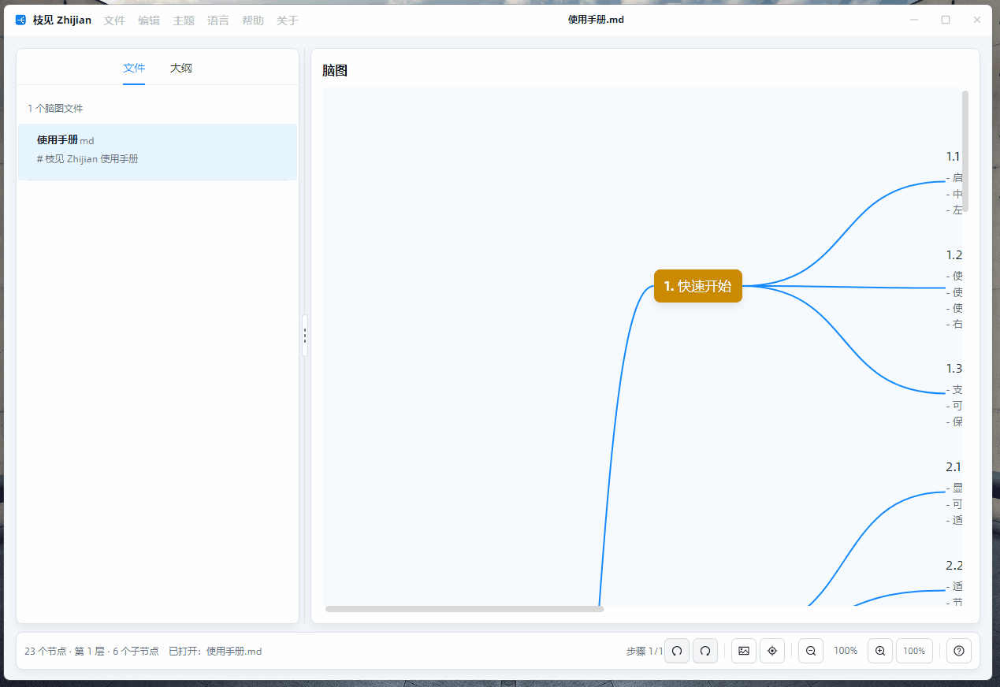

# 枝见 Zhijian

枝见是一个基于 C# 和 Avalonia 的本地 Markdown-first 脑图编辑器。它把大纲、Markdown 文本和图形脑图绑定到同一份文档模型上，适合写文章提纲、梳理功能设计和整理项目结构。

English documentation: [README.md](README.md)

仓库地址：<https://github.com/dotnet9/Zhijian>



## 功能亮点

- 启动后默认创建空白脑图，随程序输出的 `使用手册.md` 可从“帮助 -> 打开使用手册”手动载入，用作多层级示例和帮助手册。
- 文件菜单支持新建、新建窗口、打开可编辑文件、导入、打开文件夹、最近文件、保存、另存为可编辑格式、打开文件位置和关闭。
- 编辑菜单支持撤销、重做、添加同级、添加子级、提升、降级、上移、下移、删除节点和复制为 Markdown。
- 主题、语言、帮助和关于菜单集中在标题栏，常用项带有图标和快捷键。
- 语言切换使用 `Lang.Avalonia.Json` 资源，覆盖中文简体、中文繁体、英语和日语。
- 首次启动新手引导会精准高亮标题栏文件菜单、大纲编辑区、Markdown 切换、脑图画布和底部导航，并提供“跳过”按钮。
- `src/Zhijian/App.config` 集中管理新手引导、默认语言、最近文件数、历史步数和运行状态文件名。
- 左侧提供“文件 / 大纲”两个 Tab：空文件页可直接打开可编辑文件、导入、打开文件夹或打开使用手册；单独打开或导入的文件会出现在文件列表中；打开文件夹时会列出该目录下所有支持文件。
- 大纲、Markdown 和脑图视图共享同一棵 `MindMapNode` 树。
- 大纲和脑图都支持标题、备注内联编辑。
- 大纲和脑图菜单提供添加同级、添加子级、提升、降级、上移、下移、备注和删除等高频操作。
- 脑图支持画布拖拽、缩放、回到中心主题，以及基于真实节点坐标的小图导航。
- 复制为 Markdown 会把当前文档 Markdown 写入剪贴板，并显示桌面全局消息。
- “打开/另存为”聚焦 Markdown、OPML、XMind 等可编辑格式；“导入”覆盖更多只读转换格式，避免误以为能原格式保存。
- 应用外壳提供标题栏菜单、对话框、列表控件、ToolTip、全局消息和深色主题。
- 可复用的 `CodeWF.MindView` 控件只依赖 Avalonia，并与桌面应用外壳解耦。

## 运行预览

下面的截图和 GIF 已按当前界面重新制作，并使用随程序输出的使用手册，便于观察文件列表、小图、缩放和画布拖拽效果。


## 编辑流程

左侧是主要输入区。使用大纲模式快速组织层级；需要纯文本维护时切换到 Markdown；右侧脑图会从同一份数据实时刷新。

节点标题编辑时常用快捷键：

- `Enter`：添加同级节点。在中心主题上按 `Enter` 会添加子节点。
- `Tab`：将当前节点降级为上一个同级节点的子节点。
- `Shift + Tab`：提升节点。
- `Alt + Up` / `Alt + Down`：在同级节点中上移或下移。
- `Delete` 或 `Backspace`：删除空的非根节点。
- `触控板双指捏合`：围绕指针位置缩放脑图。
- `触控板双指滑动` 或 `鼠标滚轮`：平移脑图画布。
- `⌘ + 鼠标滚轮`（macOS）或 `Ctrl + 鼠标滚轮`（Windows/Linux）：围绕指针位置缩放脑图。
- `Shift + 鼠标滚轮`：横向平移脑图画布。
- `Space + 左键拖拽` 或 `鼠标中键拖拽`：拖拽脑图画布。
- `⌘ + L`（macOS）或 `Ctrl + L`（Windows/Linux）：回到中心主题。

## 文件格式

枝见默认使用可读 Markdown 保存。为避免数据丢失，另存为只提供稳定可写的可编辑格式：

- Markdown (`.md`, `.markdown`)
- OPML (`.opml`)
- XMind (`.xmind`)

其他脑图、draw.io、图片、Office、文档和数据文件可通过“导入...”转换成脑图后，再另存为上述可编辑格式。

## 复用 CodeWF.MindView

`src/CodeWF.MindView` 独立于应用外壳。新的 Avalonia 应用可以引用 `CodeWF.MindView` 和 `CodeWF.MindView.Themes`，在 `App.axaml` 注册 `<mindThemes:MindViewThemes />`，然后在页面中使用 `MindMapEditor`。普通接入只需要绑定节点集合和当前选择：

```xml
<mind:MindMapEditor
    Roots="{Binding Roots}"
    SelectedNode="{Binding SelectedNode, Mode=TwoWay}" />
```

`MindMapEditor` 内置添加子级、添加同级、升降级、同级上下移动、删除、拖拽移动和自动布局。需要接入撤销历史、保存状态或业务规则时，再把 `Controller="{Binding}"` 指向实现 `IMindMapEditorController` 的宿主 ViewModel。`src/Zhijian` 是围绕可复用控件构建文件工作流、大纲编辑、Markdown 同步和桌面外壳的完整参考。

更完整的接入说明见 [docs/source-design.zh-CN.md](docs/source-design.zh-CN.md)。

## 项目结构

```text
Zhijian/
|-- src/CodeWF.MindView/        可复用脑图控件和文档编解码
|-- src/CodeWF.MindView.Themes/ CodeWF.MindView 默认资源
|-- src/Zhijian/                枝见桌面应用
|-- docs/                       架构和源码设计文档
|-- docs/media/                 文档截图和 GIF
|-- CHANGELOG.md                英文更新日志
|-- CHANGELOG.zh-CN.md          中文更新日志
`-- Zhijian.slnx                解决方案文件
```

## 开源项目感谢

枝见的开发离不开这些优秀开源平台和项目：

- [Dotnet](https://dotnet.microsoft.com/zh-cn/)
- [Avalonia UI](https://avaloniaui.net/)
- [Semi.Avalonia](https://github.com/irihitech/Semi.Avalonia)
- [Ursa.Avalonia](https://github.com/irihitech/Ursa.Avalonia)
- [AtomUI](https://github.com/AtomUI/AtomUI)

## 开发

环境要求：

- .NET 10 SDK

常用命令：

```powershell
dotnet restore Zhijian.slnx
dotnet build Zhijian.slnx
dotnet run --project src/Zhijian/Zhijian.csproj -f net10.0
```

### macOS 打包

macOS 给别人分发时建议打成 `.app` + `.dmg`，不要只发送 `dotnet publish` 输出目录。脚本会默认生成 Intel 和 Apple Silicon 两个安装镜像：

```bash
./package_macos.sh
```

只打 Apple Silicon：

```bash
./package_macos.sh osx-arm64
```

产物会输出到 `artifacts/macos/`。未配置证书时脚本会使用 ad-hoc 签名，适合本机测试；真正发给其他 macOS 用户时，建议使用 Developer ID 证书签名并公证：

```bash
CODESIGN_IDENTITY="Developer ID Application: Your Name (TEAMID)" \
NOTARIZE=1 \
NOTARY_KEYCHAIN_PROFILE=zhijian-notary \
./package_macos.sh all
```

脚本需要 .NET 10 SDK，会自动检查 `dotnet` 和 `$HOME/.dotnet/dotnet`。如果 SDK 安装在其他位置，可设置 `DOTNET_CMD=/path/to/dotnet`。

## 文档

- [架构说明](docs/architecture.zh-CN.md)
- [Architecture](docs/architecture.md)
- [源码设计](docs/source-design.zh-CN.md)
- [Source Design](docs/source-design.md)

## 第三方开源组件审计（2026-05-20）

检查方式：`dotnet restore Zhijian.slnx --configfile <local-nuget-config>`、`dotnet list Zhijian.slnx package --include-transitive`、NuGet `.nuspec`、NuGet.org 与源码仓库信息。优先接受 MIT / Apache-2.0 / BSD；LGPL-3.0 等其它开源协议在源码与传递依赖均可追溯时单独标注。

整改：

- `CodeWF.EventBus` pin 到本次修复后的 `3.4.5.4`。
- `CodeWF.Tools.Core` pin 到本次修复后的 `1.3.13.1`。
- `Tmds.DBus.Protocol` 从传递依赖 `0.92.0` pin 到 `0.93.0`。

| 包 | 使用范围 | 协议 | 源码/项目地址 | 结论 |
| --- | --- | --- | --- | --- |
| `AtomUI.Desktop.Controls` `6.0.0-build.2` | 桌面控件、菜单、窗口 | LGPL-3.0 | https://github.com/AtomUI/AtomUI | NuGet 包指向公开源码；按“源码与传递依赖可追溯”通过 |
| `Avalonia` / `Avalonia.Desktop` / `Avalonia.Fonts.Inter` | 桌面运行时 | MIT | https://github.com/AvaloniaUI/Avalonia | 通过 |
| `CodeWF.EventBus` / `CodeWF.Markdown.Lite.Themes` / `CodeWF.Tools.Core` / `Lang.Avalonia.Json` | 自研组件 | MIT | https://github.com/dotnet9 | 自研开源包，通过 |
| `ReactiveUI.Avalonia` | MVVM | MIT | https://github.com/reactiveui/reactiveui | 通过 |
| `VC-LTL` | Windows 兼容 | EPL-2.0 | https://github.com/Chuyu-Team/VC-LTL5 | 源码开放，按“非优先但可追溯”通过 |
| `YY-Thunks` | Windows 兼容 | MIT | https://github.com/Chuyu-Team/YY-Thunks | 源码开放，通过 |
| `Tmds.DBus.Protocol` | Avalonia Linux DBus 传递依赖 | MIT | https://github.com/tmds/Tmds.DBus | 通过，pin 到 `0.93.0` |

传递依赖检查结论：AtomUI 链路中的 `AtomUI.Controls`、`AtomUI.Controls.Shared`、`AtomUI.Core`、`AtomUI.Fonts.AlibabaSans`、`AtomUI.Icons.AntDesign`、`AtomUI.Native` 均来自公开源码仓库；Avalonia / SkiaSharp / ANGLE、ReactiveUI / Splat、Svg.Controls.Avalonia / Svg.*、ExCSS、DynamicData、HarfBuzzSharp、MicroCom.Runtime 均有公开源码。有效 restore 未发现 `AvaloniaUI.DiagnosticsSupport`、`Semi.Avalonia.*` 黑盒扩展或 `System.Drawing.Common 4.7.0`。
