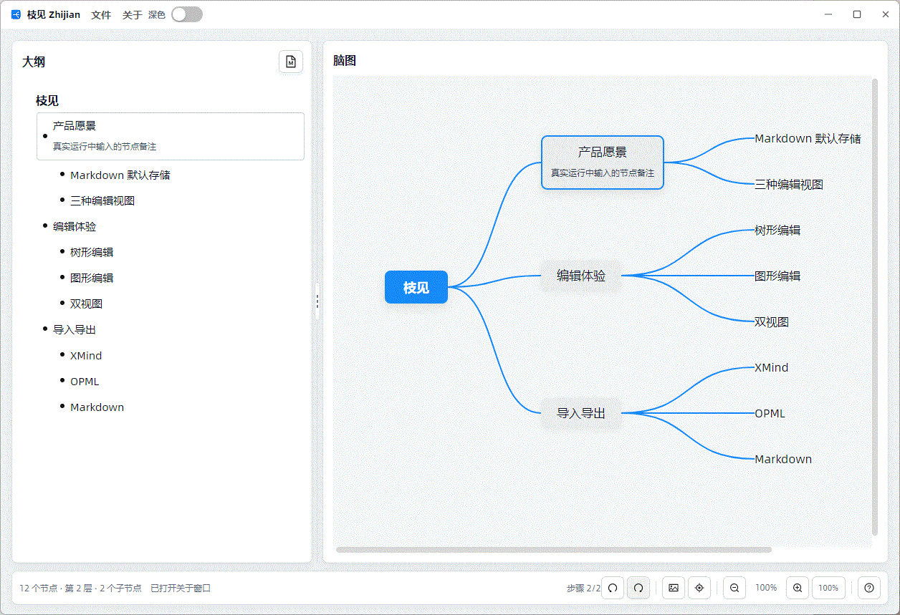
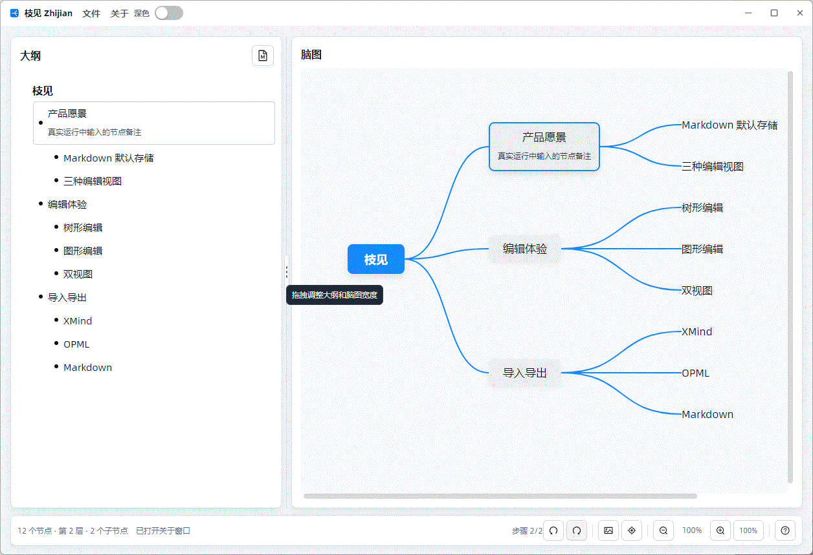

# Zhijian Architecture

Chinese version: [architecture.zh-CN.md](architecture.zh-CN.md)

Zhijian is an Avalonia and AtomUI desktop application for editing Markdown-first mind maps. The repository separates reusable mind-map functionality from the application shell:

- `CodeWF.MindView` contains the shared node model, editor control, mini-map control, and Markdown/OPML/XMind codecs.
- `CodeWF.MindView.Themes` contains default Avalonia resources for the reusable controls.
- `Zhijian` contains the AtomUI desktop shell, title-bar menus, outline editor, Markdown pane, dialogs, file services, and application ViewModels.


## Runtime Evidence

The screenshots and GIFs in `docs/media` were captured from a real running Zhijian desktop session with simulated user operations.





## Dependency Direction

```text
Zhijian
  |-- references AtomUI, CodeWF.MindView, CodeWF.MindView.Themes
  |-- owns desktop shell, menus, dialogs, file pickers, and ViewModels
  |
  +--> CodeWF.MindView.Themes
       |-- references CodeWF.MindView resources
       |
       +--> CodeWF.MindView
            |-- references Avalonia only
            |-- owns model, mind-map editor, mini-map, and codecs
```

`CodeWF.MindView` intentionally has no AtomUI dependency. This keeps the mind-map editor reusable in a plain Avalonia application, while Zhijian can still use AtomUI for its window, menus, buttons, text boxes, tooltips, and dialogs.

## Product Scope

- Split view with outline or Markdown editing on the left and a graphical mind-map editor on the right.
- Visible splitter for resizing the outline and mind-map panes.
- Outline editor with title editing, notes, Enter/Tab/Shift+Tab/Delete rules, and high-frequency structure menus.
- Mind-map editor with inline title editing, note editing, drag/drop structure changes, panning, zooming, mini-map navigation, and center-topic navigation.
- Title-bar File and About menus implemented with AtomUI `Menu` and `MenuItem`.
- About and changelog dialogs implemented in AXML with ViewModels.
- Markdown, OPML, and XMind import/export.

## Data Flow

`MainWindowViewModel` owns an `ObservableCollection<MindMapNode> Roots` and a two-way `SelectedNode`. The outline, Markdown text, mind-map editor, and mini-map all observe the same tree model.

Title, note, color, and tree-structure changes trigger layout recalculation, Markdown synchronization, statistics updates, and history snapshots. Because the model is shared, editing in one view immediately updates the other views.

## Platform Scope

The desktop application targets `net10.0`. The reusable `CodeWF.MindView` libraries multi-target `net8.0`, `net9.0`, and `net10.0` so the control can be reused outside the Zhijian desktop shell.

See [source-design.md](source-design.md) for deeper implementation notes and reusable-control integration details.
